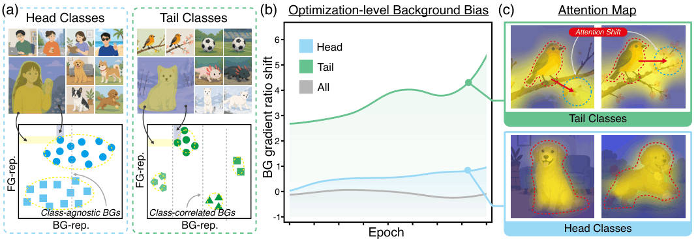
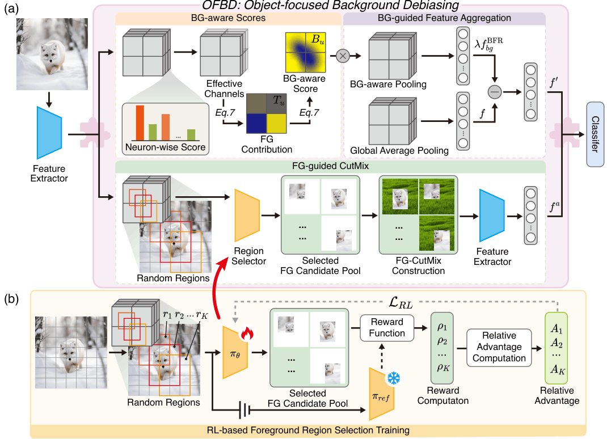
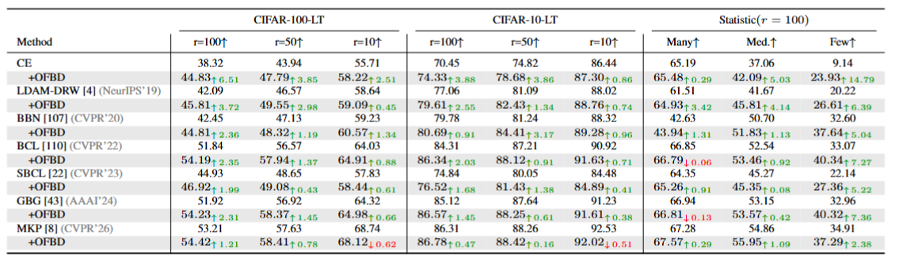
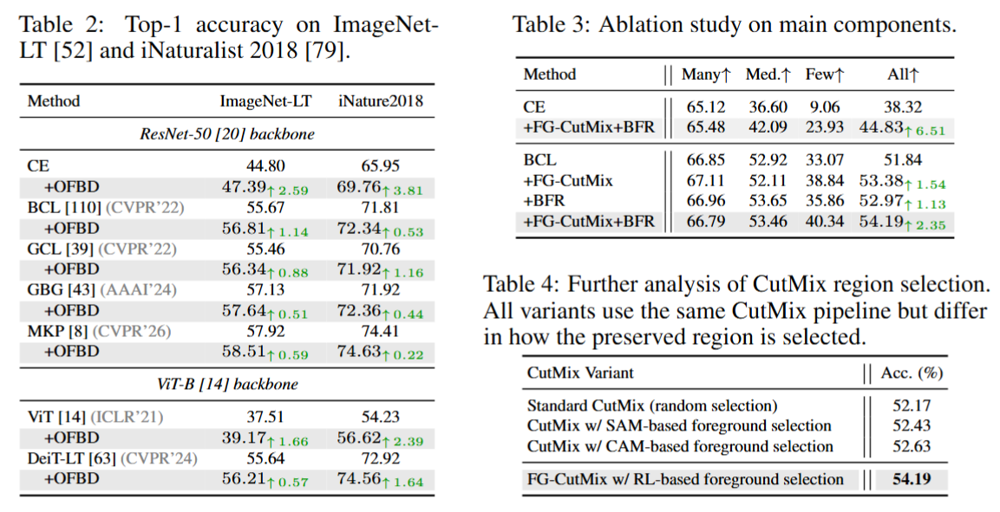
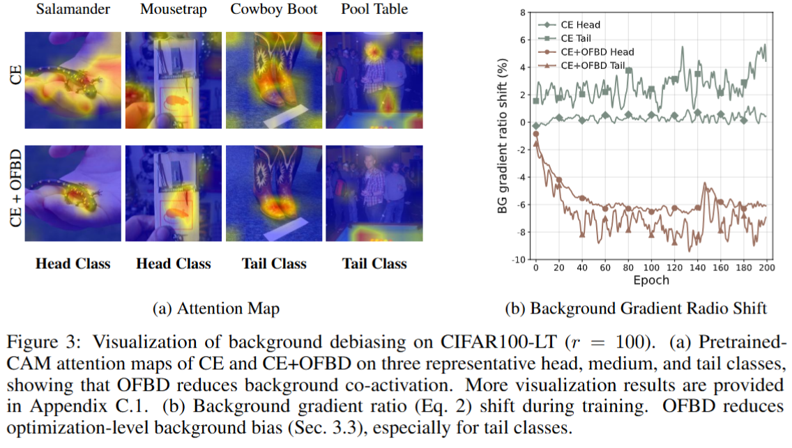
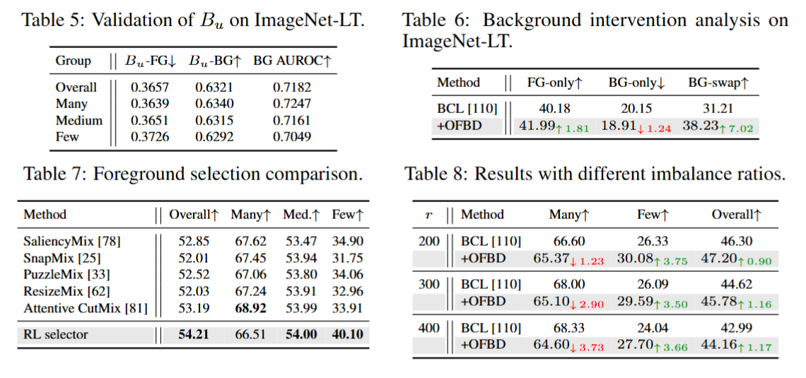

# OFBD

## OFBD: Object-Focused Background Debiasing for Long-Tailed Learning


<p align="center">

</p>


OFBD is a long-tailed image recognition framework that mitigates background bias from both distribution and optimization perspectives.

Existing long-tailed recognition methods mainly focus on re-balancing, representation learning, or data augmentation. OFBD reveals that long-tailed training introduces background-biased representations and optimization dynamics, causing tail classes to rely on irrelevant contextual cues.

To address this issue, OFBD introduces two complementary components:

- **Foreground-guided CutMix (FG-CutMix)** for reducing distribution-level background bias.
- **Background-guided Feature Rectification (BFR)** for suppressing optimization-level background bias.

Together, OFBD encourages models to focus on target-related foreground semantics rather than spurious background information.


<p align="center">
<a href="static/pdfs/OFBD_Paper.pdf">

</a>

<a href="static/pdfs/OFBD_Supplement.pdf">

</a>
</p>


# Method


<p align="center">

</p>


OFBD consists of two major modules:


### Foreground-guided CutMix (FG-CutMix)

FG-CutMix preserves target-related foreground regions while replacing complementary backgrounds.

Unlike conventional CutMix, which may randomly introduce irrelevant backgrounds, FG-CutMix selects informative foreground regions to reduce foreground-background co-occurrence and improve tail-class representation learning.


### Background-guided Feature Rectification (BFR)

BFR estimates background-aware scores from feature statistics and suppresses background-biased feature locations.

It introduces no additional learnable parameters and avoids head-class dominated optimization, making it suitable for long-tailed recognition.


# Visualization and Results


## Motivation Analysis


<p align="center">

</p>


## Main Results


<p align="center">

</p>


## Ablation Study


<p align="center">

</p>


## Further Analysis


<p align="center">

</p>


# Repository Structure


```
OFBD.github.io/

├── index.html

├── static/

│   ├── images/

│   │   ├── Figure_overview-1.png

│   │   ├── Figure_pipeline-1.png

│   │   ├── exp1.png

│   │   ├── exp2.png

│   │   ├── exp3.png

│   │   └── exp4.png

│   │

│   ├── pdfs/

│   │   ├── OFBD_Paper.pdf

│   │   └── OFBD_Supplement.pdf

│   │

│   ├── css/

│   └── js/

```


# Paper


The paper and supplementary material are available below:


- [Paper](static/pdfs/OFBD_Paper.pdf)

- [Supplementary Material](static/pdfs/OFBD_Supplement.pdf)


# Citation


If you find OFBD useful for your research, please cite:


```bibtex
@inproceedings{chen2026ofbd,

title={OFBD: Object-Focused Background Debiasing for Long-Tailed Learning},

author={Chen, Shenghan and Liu, Yiming and Deng, Zhipeng and Wang, Haolin and Zhou, Jiale and Wu, Zhijian and Lu, Xiankai and Ou, Yafei and Zheng, Yefeng},

booktitle={Advances in Neural Information Processing Systems},

year={2026}

}
```


# Acknowledgements


OFBD incorporates code from previous open-source projects.

Please refer to the corresponding licenses and acknowledgements for third-party components.


